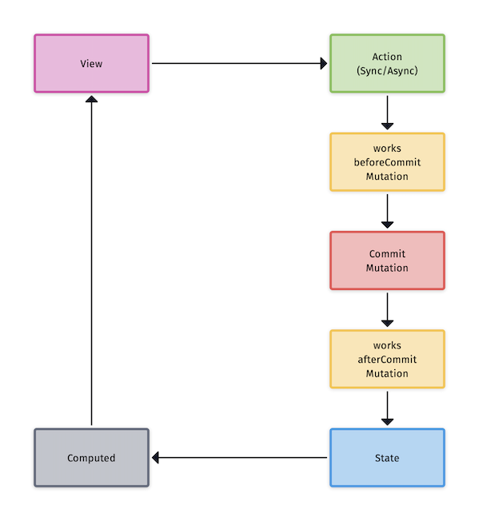

[English](https://github.com/ReactComponentKit/Redux/blob/main/README.md) | [한국어](./https://github.com/ReactComponentKit/Redux/blob/main/README_ko.md)

# Redux


[](https://developer.apple.com/swift/)

Implementing Redux with async/await introduced in Swift 5.5 has become very simple. From Xcode 13.2, Swift 5.5's new concurrency supports iOS 13. Therefore, the existing Redux package was newly implemented based on async/await.

## Installation

Redux only support Swift Package Manager. 

```swift
dependencies: [
    .package(url: "https://github.com/ReactComponentKit/Redux.git", from: "1.0.0"),
]
```

## Flow



The figure above shows the flow of Redux. There's a lot of content, but it's actually very concise. The store handles most of the flow. All the developer has to do is define State and Store and define the functions that perform Action and Mutation. Additionally, middleware-like jobs can be defined so that you can do the necessary tasks before or after Mutation occurs.

## State

State can be defined as below.

```swift
struct Counter: State {
    var count = 0
}
```

Note that State should comply with Equatable.


## Store

When defining a store, a state is required. You can define the store as below.

```swift
struct Counter: State {
    var count = 0
}

class CounterStore: Store<Counter> {
    init() {
        super.init(state: Counter())
    }
}
```

The store provides the following methods.

- commit(mutation:, payload:)
- dispatch(action:, payload:) async
- dispatch(action:, payload:)

When creating a custom store, the method mainly used will be commit(mutation:, payload:). dispatch(action:, payload:) is very rarely used.

## Mutation

Mutation is defined as a store method. The Mutation method is a sync method.

```swift
// mutation
private func increment(counter: inout Counter, payload: Int) {
    counter.count += payload
}
    
private func decrement(counter: inout Counter, payload: Int) {
    counter.count -= payload
}
```

## Action

Action is also defined by the store's method. There is no need to create a separate custom data type for action anymore.

```swift
// actions
func incrementAction(payload: Int) {
    self.commit(mutation: increment, payload: payload)
}
    
func decrementAction(payload: Int) {
    self.commit(mutation: decrement, payload: payload)
}
    
func asyncIncrementAction(payload: Int) async {
    await Task.sleep(1 * 1_000_000_000)
    self.commit(mutation: increment, payload: payload)
}
    
func asyncDecrementAction(payload: Int) async {
    await Task.sleep(1 * 1_000_000_000)
    self.commit(mutation: decrement, payload: payload)
}
```

Since Action is defined as a store method, there are very few cases where the store's dispatch method is actually used.


## Computed

Define the properties to connect to View. The store does not publish the state. Therefore, in order to publish a specific property of the state, a value can be injected into the property in the computed step.

```swift
class CounterStore: Store<Counter> {
    init() {
        super.init(state: Counter())
    }
    
    // refs or computed
    @Published
    var count = 0
    
    override func computed(new: Counter, old: Counter) {
        self.count = new.count
    }
    ...
}
```

## CounterStore

The entire code of CounterStore defined so far is as follows.

```swift
import Foundation
import Redux

struct Counter: State {
    var count = 0
}

class CounterStore: Store<Counter> {
    init() {
        super.init(state: Counter())
    }
    
    // refs or computed
    @Published
    var count = 0
    
    override func computed(new: Counter, old: Counter) {
        self.count = new.count
    }
    
    // mutation
    private func increment(counter: inout Counter, payload: Int) {
        counter.count += payload
    }
    
    private func decrement(counter: inout Counter, payload: Int) {
        counter.count -= payload
    }
    
    // actions
    func incrementAction(payload: Int) {
        self.commit(mutation: increment, payload: payload)
    }
    
    func decrementAction(payload: Int) {
        self.commit(mutation: decrement, payload: payload)
    }
    
    func asyncIncrementAction(payload: Int) async {
        await Task.sleep(1 * 1_000_000_000)
        self.commit(mutation: increment, payload: payload)
    }
    
    func asyncDecrementAction(payload: Int) async {
        await Task.sleep(1 * 1_000_000_000)
        self.commit(mutation: decrement, payload: payload)
    }
}
```


## Middleware

You can optionally add middlewares. Middleware is a collection of functions called before or after all Mutations.

```swift
class WorksBeforeCommitStore: Store<ReduxState> {
    init() {
        super.init(state: ReduxState())
    }
    
    override func worksBeforeCommit() -> [(inout ReduxState) -> Void] {
        return [
            { (mutableState) in
                mutableState.count = -10
            }
        ]
    }
}

class WorksAfterCommitStore: Store<ReduxState> {
    init() {
        super.init(state: ReduxState())
    }
    
    override func worksAfterCommit() -> [(inout ReduxState) -> Void] {
        return [
            { (mutableState) in
                mutableState.count *= 2
            }
        ]
    }
}
```

## UnitTest

It is very easy to test the CounterStore defined above.

```swift
import XCTest
@testable import Redux

final class CounterStoreTests: XCTestCase {
    private var store: CounterStore!
    
    override func setUp() {
        super.setUp()
        store = CounterStore()
    }
    
    override func tearDown() {
        super.tearDown()
        store = nil
    }
    
    func testInitialState() {
        XCTAssertEqual(0, store.state.count)
    }
    
    func testIncrementAction() {
        store.incrementAction(payload: 1)
        XCTAssertEqual(1, store.state.count)
        store.incrementAction(payload: 10)
        XCTAssertEqual(11, store.state.count)
    }
    
    func testPublisherValue() {
        XCTAssertEqual(0, store.count)
        store.incrementAction(payload: 1)
        XCTAssertEqual(1, store.count)
        store.incrementAction(payload: 10)
        XCTAssertEqual(11, store.count)
        store.decrementAction(payload: 10)
        XCTAssertEqual(1, store.count)
        store.decrementAction(payload: 1)
        XCTAssertEqual(0, store.count)
    }
    
    func testAsyncIncrementAction() async {
        await store.asyncIncrementAction(payload: 1)
        XCTAssertEqual(1, store.state.count)
        XCTAssertEqual(1, store.count)
        await store.asyncIncrementAction(payload: 10)
        XCTAssertEqual(11, store.state.count)
        XCTAssertEqual(11, store.count)
    }
    
    func testAsyncDecrementAction() async {
        await store.asyncDecrementAction(payload: 1)
        XCTAssertEqual(-1, store.state.count)
        XCTAssertEqual(-1, store.count)
        await store.asyncDecrementAction(payload: 10)
        XCTAssertEqual(-11, store.state.count)
        XCTAssertEqual(-11, store.count)
    }
}
```

## UserStore

Let's define a store that uses API([https://jsonplaceholder.typicode.com](https://jsonplaceholder.typicode.com)).

```swift
import Foundation
import Redux

struct User: Equatable, Codable {
    let id: Int
    var name: String
}

struct UserState: State {
    var users: [User] = []
}

class UserStore: Store<UserState> {
    
    init() {
        super.init(state: UserState())
    }
    
    // mutations
    private func SET_USERS(userState: inout UserState, payload: [User]) {
        userState.users = payload
    }
    
    private func SET_USER(userState: inout UserState, payload: User) {
        let index = userState.users.firstIndex { it in
            it.id == payload.id
        }
        
        if let index = index {
            userState.users[index] = payload
        }
    }
    
    // actions
    func loadUsers() async {
        do {
            let (data, _) = try await URLSession.shared.data(from: URL(string: "https://jsonplaceholder.typicode.com/users/")!)
            let users = try JSONDecoder().decode([User].self, from: data)
            commit(mutation: SET_USERS, payload: users)
        } catch {
            print(#function, error)
            commit(mutation: SET_USERS, payload: [])
        }
    }
    
    func update(user: User) async throws {
        let params = try JSONEncoder().encode(user)
        var request = URLRequest(url: URL(string: "https://jsonplaceholder.typicode.com/users/\(user.id)")!)
        request.httpMethod = "PUT"
        request.httpBody = params
        request.addValue("application/json", forHTTPHeaderField: "Content-Type")
        request.addValue("application/json", forHTTPHeaderField: "Accept")
        let (data, _) = try await URLSession.shared.data(for: request)
        let user = try JSONDecoder().decode(User.self, from: data)
        commit(mutation: SET_USER, payload: user)
    }
}
```

You can test the above UserStore as follows.

```swift
import XCTest
@testable import Redux

final class UserStoreTests: XCTestCase {
    private var store: UserStore!
    
    override func setUp() {
        super.setUp()
        store = UserStore()
    }
    
    override func tearDown() {
        super.tearDown()
        store = nil
    }
    
    func testInitialState() {
        XCTAssertEqual([], store.state.users)
    }
    
    func testLoadUsers() async {
        await store.loadUsers()
        XCTAssertEqual(10, store.state.users.count)
        for user in store.state.users {
            XCTAssertGreaterThan(user.id, 0)
            XCTAssertNotEqual(user.name, "")
        }
    }
 
    func testUpdateUser() async {
        do {
            await store.loadUsers()
            XCTAssertEqual(10, store.state.users.count)
            var mutableUser = store.state.users[0]
            mutableUser.name = "Sungcheol Kim"
            try await store.update(user: mutableUser)
            XCTAssertEqual(10, store.state.users.count)
            let user = store.state.users[0]
            XCTAssertEqual("Sungcheol Kim", user.name)
        } catch {
            XCTFail("Failed update user")
        }
    }
}
```

## Store Composition

It is necessary to manage the app status in one place with Single Source of Truth. In that case, it is dangerous to define all states of the app in one state. Therefore, it is recommended to divide the state into modules and create and manage a store that manages each state. You can define the App Store as below.


```swift
import Foundation
import Redux

struct AppState: State {
}

class AppStore: Store<AppState> {
    
    // composition store
    let counter = CounterStore()
    let users = UserStore()
    
    init() {
        super.init(state: AppState())
    }
}
```

You can use the AppStore above as follows.

```swift
import XCTest
@testable import Redux

// Single Source of Truth
final class SSOTTests: XCTestCase {
    private var store: AppStore!
    
    override func setUp() {
        super.setUp()
        store = AppStore()
    }
    
    override func tearDown() {
        super.tearDown()
        store = nil
    }
    
    func testLoadUsers() async {
        await store.users.loadUsers()
        XCTAssertEqual(10, store.users.state.users.count)
        for user in store.users.state.users {
            XCTAssertGreaterThan(user.id, 0)
            XCTAssertNotEqual(user.name, "")
        }
    }
 
    func testUpdateUser() async {
        do {
            await store.users.loadUsers()
            XCTAssertEqual(10, store.users.state.users.count)
            var mutableUser = store.users.state.users[0]
            mutableUser.name = "Sungcheol Kim"
            try await store.users.update(user: mutableUser)
            XCTAssertEqual(10, store.users.state.users.count)
            let user = store.users.state.users[0]
            XCTAssertEqual("Sungcheol Kim", user.name)
        } catch {
            XCTFail("Failed update user")
        }
    }
    
    func testIncrementAction() {
        store.counter.incrementAction(payload: 1)
        XCTAssertEqual(1, store.counter.state.count)
        store.counter.incrementAction(payload: 10)
        XCTAssertEqual(11, store.counter.state.count)
    }
    
    func testPublisherValue() {
        XCTAssertEqual(0, store.counter.count)
        store.counter.incrementAction(payload: 1)
        XCTAssertEqual(1, store.counter.count)
        store.counter.incrementAction(payload: 10)
        XCTAssertEqual(11, store.counter.count)
        store.counter.decrementAction(payload: 10)
        XCTAssertEqual(1, store.counter.count)
        store.counter.decrementAction(payload: 1)
        XCTAssertEqual(0, store.counter.count)
    }
    
    func testAsyncIncrementAction() async {
        await store.counter.asyncIncrementAction(payload: 1)
        XCTAssertEqual(1, store.counter.state.count)
        XCTAssertEqual(1, store.counter.count)
        await store.counter.asyncIncrementAction(payload: 10)
        XCTAssertEqual(11, store.counter.state.count)
        XCTAssertEqual(11, store.counter.count)
    }
    
    func testAsyncDecrementAction() async {
        await store.counter.asyncDecrementAction(payload: 1)
        XCTAssertEqual(-1, store.counter.state.count)
        XCTAssertEqual(-1, store.counter.count)
        await store.counter.asyncDecrementAction(payload: 10)
        XCTAssertEqual(-11, store.counter.state.count)
        XCTAssertEqual(-11, store.counter.count)
    }
}
```

## MIT License

Copyright (c) 2021 Redux, ReactComponentKit

Permission is hereby granted, free of charge, to any person obtaining a copy
of this software and associated documentation files (the "Software"), to deal
in the Software without restriction, including without limitation the rights
to use, copy, modify, merge, publish, distribute, sublicense, and/or sell
copies of the Software, and to permit persons to whom the Software is
furnished to do so, subject to the following conditions:

The above copyright notice and this permission notice shall be included in all
copies or substantial portions of the Software.

THE SOFTWARE IS PROVIDED "AS IS", WITHOUT WARRANTY OF ANY KIND, EXPRESS OR
IMPLIED, INCLUDING BUT NOT LIMITED TO THE WARRANTIES OF MERCHANTABILITY,
FITNESS FOR A PARTICULAR PURPOSE AND NONINFRINGEMENT. IN NO EVENT SHALL THE
AUTHORS OR COPYRIGHT HOLDERS BE LIABLE FOR ANY CLAIM, DAMAGES OR OTHER
LIABILITY, WHETHER IN AN ACTION OF CONTRACT, TORT OR OTHERWISE, ARISING FROM,
OUT OF OR IN CONNECTION WITH THE SOFTWARE OR THE USE OR OTHER DEALINGS IN THE
SOFTWARE.