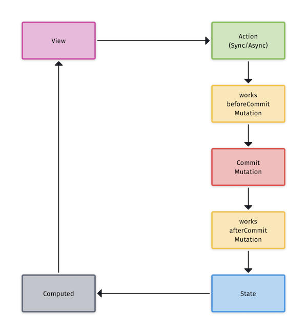

[English](https://github.com/ReactComponentKit/Redux/blob/main/README.md) | [한국어](https://github.com/ReactComponentKit/Redux/blob/main/README_ko.md)

# Redux


[](https://developer.apple.com/swift/)

Swift 5.5에서 소개된 async/await로 Redux를 구현하는 일이 매우 간소해졌습니다. Xcode 13.2 버전부터는 Swift 5.5의 새로운 Concurrency가 iOS 13을 지원한다고 합니다. 이에 기존의 Redux 패키지를 async/await 를 바탕으로 새로 구현하였습니다.

## 사용하기

Redux only support Swift Package Manager. 

```swift
dependencies: [
    .package(url: "https://github.com/ReactComponentKit/Redux.git", from: "1.1.0"),
]
```

## 흐름



위 그림은 Redux의 흐름을 나타낸 것입니다. 많은 내용이 있지만 실제로는 매우 간결합니다. 흐름 대부분을 Store가 처리합니다. 개발자가 해야할 일은 State와 Store를 정의하고 Action과 Mutation을 수행하는 함수를 정의하는 것 뿐입니다. 추가로 Mutation이 발생하기 전 또는 후에 필요한 작업을 할 수 있도록 미들웨어 성격의 Job을 정의할 수 있습니다.

## State 정의

State는 아래와 같이 정의할 수 있습니다.

```swift
struct Counter: State {
    var count = 0
}
```

주의할 점은 State는 Equatable을 준수해야 합니다.


## Store 정의

Store를 정의할 때, State가 필요합니다. 아래와 같이 Store를 정의할 수 있습니다.

```swift
struct Counter: State {
    var count = 0
}

class CounterStore: Store<Counter> {
    init() {
        super.init(state: Counter())
    }
}
```

Store는 다음 메서드를 제공합니다.

- commit(mutation:, payload:)
- dispatch(action:, payload:) async
- dispatch(action:, payload:)

사용자 정의 Store를 만들 때, 주로 사용하는 메서드는 commit(mutation:, payload:)가 될 것 입니다. dispatch(action:, payload:) 는 사용되는 경우가 매우 적습니다.

## Mutation 정의

Mutation은 스토어의 메서드로 정의합니다. Mutation 메서드는 sync 메서드입니다.

```swift
// mutation
private func increment(counter: inout Counter, payload: Int) {
    counter.count += payload
}
    
private func decrement(counter: inout Counter, payload: Int) {
    counter.count -= payload
}
```

## Action 정의

Action 도 Store의 메서드로 정의합니다. 더 이상 Action을 위해 따로 struct와 같은 타입을 만들 필요가 없습니다. 

```swift
// actions
func incrementAction(payload: Int) {
    self.commit(mutation: increment, payload: payload)
}
    
func decrementAction(payload: Int) {
    self.commit(mutation: decrement, payload: payload)
}
    
func asyncIncrementAction(payload: Int) async {
    await Task.sleep(1 * 1_000_000_000)
    self.commit(mutation: increment, payload: payload)
}
    
func asyncDecrementAction(payload: Int) async {
    await Task.sleep(1 * 1_000_000_000)
    self.commit(mutation: decrement, payload: payload)
}
```

Action을 Store의 메서드로 정의하기 때문에 실제로 Store의 dispatch 메서드를 사용하는 경우는 매우 적습니다.


## Computed

View 에 연결할 속성을 정의합니다. Store는 state를 Publish 하지 않습니다. 따라서 상태의 특정 속성을 Publish 하기 위해서, Computed 단계에서 해당 속성에 값을 주입할 수 있습니다.

```swift
class CounterStore: Store<Counter> {
    init() {
        super.init(state: Counter())
    }
    
    // refs or computed
    @Published
    var count = 0
    
    override func computed(new: Counter, old: Counter) {
        self.count = new.count
    }
    ...
}
```

## CounterStore

지금까지 정의한 CounterStore의 전체 코드는 아래와 같습니다.

```swift
import Foundation
import Redux

struct Counter: State {
    var count = 0
}

class CounterStore: Store<Counter> {
    init() {
        super.init(state: Counter())
    }
    
    // refs or computed
    @Published
    var count = 0
    
    override func computed(new: Counter, old: Counter) {
        self.count = new.count
    }
    
    // mutation
    private func increment(counter: inout Counter, payload: Int) {
        counter.count += payload
    }
    
    private func decrement(counter: inout Counter, payload: Int) {
        counter.count -= payload
    }
    
    // actions
    func incrementAction(payload: Int) {
        self.commit(mutation: increment, payload: payload)
    }
    
    func decrementAction(payload: Int) {
        self.commit(mutation: decrement, payload: payload)
    }
    
    func asyncIncrementAction(payload: Int) async {
        await Task.sleep(1 * 1_000_000_000)
        self.commit(mutation: increment, payload: payload)
    }
    
    func asyncDecrementAction(payload: Int) async {
        await Task.sleep(1 * 1_000_000_000)
        self.commit(mutation: decrement, payload: payload)
    }
}
```


## Middleware 정의

선택적으로 Middleware를 추가할 수 있습니다. 미들웨어는 모든 Mutation 전 또는 후에 호출되는 함수 모음입니다.

```swift
class WorksBeforeCommitStore: Store<ReduxState> {
    init() {
        super.init(state: ReduxState())
    }
    
    override func worksBeforeCommit() -> [(inout ReduxState) -> Void] {
        return [
            { (mutableState) in
                mutableState.count = -10
            }
        ]
    }
}

class WorksAfterCommitStore: Store<ReduxState> {
    init() {
        super.init(state: ReduxState())
    }
    
    override func worksAfterCommit() -> [(inout ReduxState) -> Void] {
        return [
            { (mutableState) in
                mutableState.count *= 2
            }
        ]
    }
}
```

## UnitTest

위에서 정의한 CounterStore를 아주 쉽게 테스트할 수 있습니다.

```swift
import XCTest
@testable import Redux

final class CounterStoreTests: XCTestCase {
    private var store: CounterStore!
    
    override func setUp() {
        super.setUp()
        store = CounterStore()
    }
    
    override func tearDown() {
        super.tearDown()
        store = nil
    }
    
    func testInitialState() {
        XCTAssertEqual(0, store.state.count)
    }
    
    func testIncrementAction() {
        store.incrementAction(payload: 1)
        XCTAssertEqual(1, store.state.count)
        store.incrementAction(payload: 10)
        XCTAssertEqual(11, store.state.count)
    }
    
    func testPublisherValue() {
        XCTAssertEqual(0, store.count)
        store.incrementAction(payload: 1)
        XCTAssertEqual(1, store.count)
        store.incrementAction(payload: 10)
        XCTAssertEqual(11, store.count)
        store.decrementAction(payload: 10)
        XCTAssertEqual(1, store.count)
        store.decrementAction(payload: 1)
        XCTAssertEqual(0, store.count)
    }
    
    func testAsyncIncrementAction() async {
        await store.asyncIncrementAction(payload: 1)
        XCTAssertEqual(1, store.state.count)
        XCTAssertEqual(1, store.count)
        await store.asyncIncrementAction(payload: 10)
        XCTAssertEqual(11, store.state.count)
        XCTAssertEqual(11, store.count)
    }
    
    func testAsyncDecrementAction() async {
        await store.asyncDecrementAction(payload: 1)
        XCTAssertEqual(-1, store.state.count)
        XCTAssertEqual(-1, store.count)
        await store.asyncDecrementAction(payload: 10)
        XCTAssertEqual(-11, store.state.count)
        XCTAssertEqual(-11, store.count)
    }
}
```

## UserStore

[https://jsonplaceholder.typicode.com](https://jsonplaceholder.typicode.com) API를 사용하는 Store를 간략하게 작성해 보면 아래와 같습니다.

```swift
import Foundation
import Redux

struct User: Equatable, Codable {
    let id: Int
    var name: String
}

struct UserState: State {
    var users: [User] = []
}

class UserStore: Store<UserState> {
    
    init() {
        super.init(state: UserState())
    }
    
    // mutations
    private func SET_USERS(userState: inout UserState, payload: [User]) {
        userState.users = payload
    }
    
    private func SET_USER(userState: inout UserState, payload: User) {
        let index = userState.users.firstIndex { it in
            it.id == payload.id
        }
        
        if let index = index {
            userState.users[index] = payload
        }
    }
    
    // actions
    func loadUsers() async {
        do {
            let (data, _) = try await URLSession.shared.data(from: URL(string: "https://jsonplaceholder.typicode.com/users/")!)
            let users = try JSONDecoder().decode([User].self, from: data)
            commit(mutation: SET_USERS, payload: users)
        } catch {
            print(#function, error)
            commit(mutation: SET_USERS, payload: [])
        }
    }
    
    func update(user: User) async throws {
        let params = try JSONEncoder().encode(user)
        var request = URLRequest(url: URL(string: "https://jsonplaceholder.typicode.com/users/\(user.id)")!)
        request.httpMethod = "PUT"
        request.httpBody = params
        request.addValue("application/json", forHTTPHeaderField: "Content-Type")
        request.addValue("application/json", forHTTPHeaderField: "Accept")
        let (data, _) = try await URLSession.shared.data(for: request)
        let user = try JSONDecoder().decode(User.self, from: data)
        commit(mutation: SET_USER, payload: user)
    }
}
```

위 UserStore를 아래와 같이 테스트할 수 있습니다.

```swift
import XCTest
@testable import Redux

final class UserStoreTests: XCTestCase {
    private var store: UserStore!
    
    override func setUp() {
        super.setUp()
        store = UserStore()
    }
    
    override func tearDown() {
        super.tearDown()
        store = nil
    }
    
    func testInitialState() {
        XCTAssertEqual([], store.state.users)
    }
    
    func testLoadUsers() async {
        await store.loadUsers()
        XCTAssertEqual(10, store.state.users.count)
        for user in store.state.users {
            XCTAssertGreaterThan(user.id, 0)
            XCTAssertNotEqual(user.name, "")
        }
    }
 
    func testUpdateUser() async {
        do {
            await store.loadUsers()
            XCTAssertEqual(10, store.state.users.count)
            var mutableUser = store.state.users[0]
            mutableUser.name = "Sungcheol Kim"
            try await store.update(user: mutableUser)
            XCTAssertEqual(10, store.state.users.count)
            let user = store.state.users[0]
            XCTAssertEqual("Sungcheol Kim", user.name)
        } catch {
            XCTFail("Failed update user")
        }
    }
}
```

## Store 조합

Single Source of Truth 로 앱 상태를 한 곳에서 관리할 필요가 있습니다. 그럴 때, 한 State에 앱의 모든 State를 정의하는 것은 위험합니다. 그래서 State를 모듈 단위로 나누어서 각 State를 관리하는 Store를 만들어 관리하는 것이 좋습니다. 아래와 같이 AppStore를 정의할 수 있습니다.


```swift
import Foundation
import Redux

struct AppState: State {
}

class AppStore: Store<AppState> {
    
    // composition store
    let counter = CounterStore()
    let users = UserStore()
    
    init() {
        super.init(state: AppState())
    }
}
```

위 AppStore를 아래와 같이 사용할 수 있습니다.

```swift
import XCTest
@testable import Redux

// Single Source of Truth
final class SSOTTests: XCTestCase {
    private var store: AppStore!
    
    override func setUp() {
        super.setUp()
        store = AppStore()
    }
    
    override func tearDown() {
        super.tearDown()
        store = nil
    }
    
    func testLoadUsers() async {
        await store.users.loadUsers()
        XCTAssertEqual(10, store.users.state.users.count)
        for user in store.users.state.users {
            XCTAssertGreaterThan(user.id, 0)
            XCTAssertNotEqual(user.name, "")
        }
    }
 
    func testUpdateUser() async {
        do {
            await store.users.loadUsers()
            XCTAssertEqual(10, store.users.state.users.count)
            var mutableUser = store.users.state.users[0]
            mutableUser.name = "Sungcheol Kim"
            try await store.users.update(user: mutableUser)
            XCTAssertEqual(10, store.users.state.users.count)
            let user = store.users.state.users[0]
            XCTAssertEqual("Sungcheol Kim", user.name)
        } catch {
            XCTFail("Failed update user")
        }
    }
    
    func testIncrementAction() {
        store.counter.incrementAction(payload: 1)
        XCTAssertEqual(1, store.counter.state.count)
        store.counter.incrementAction(payload: 10)
        XCTAssertEqual(11, store.counter.state.count)
    }
    
    func testPublisherValue() {
        XCTAssertEqual(0, store.counter.count)
        store.counter.incrementAction(payload: 1)
        XCTAssertEqual(1, store.counter.count)
        store.counter.incrementAction(payload: 10)
        XCTAssertEqual(11, store.counter.count)
        store.counter.decrementAction(payload: 10)
        XCTAssertEqual(1, store.counter.count)
        store.counter.decrementAction(payload: 1)
        XCTAssertEqual(0, store.counter.count)
    }
    
    func testAsyncIncrementAction() async {
        await store.counter.asyncIncrementAction(payload: 1)
        XCTAssertEqual(1, store.counter.state.count)
        XCTAssertEqual(1, store.counter.count)
        await store.counter.asyncIncrementAction(payload: 10)
        XCTAssertEqual(11, store.counter.state.count)
        XCTAssertEqual(11, store.counter.count)
    }
    
    func testAsyncDecrementAction() async {
        await store.counter.asyncDecrementAction(payload: 1)
        XCTAssertEqual(-1, store.counter.state.count)
        XCTAssertEqual(-1, store.counter.count)
        await store.counter.asyncDecrementAction(payload: 10)
        XCTAssertEqual(-11, store.counter.state.count)
        XCTAssertEqual(-11, store.counter.count)
    }
}
```